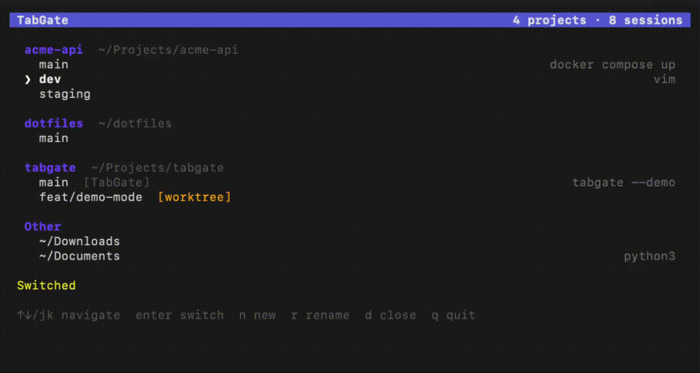

# TabGate

A TUI that groups your terminal tabs by git project across Terminal.app and Ghostty.



## Features

- Groups tabs by git project — not by terminal emulator
- Shows current branch, worktree status, and running command for each tab
- Switch focus, create, rename, and close tabs from one place
- Auto-detects running terminal emulators
- Tabs outside a git repo are collected under "Other"
- Self-excludes its own session from the listing
- Live-refreshes every 1-2 seconds

## Installation

**Prerequisites:** Go 1.26+, macOS

```sh
git clone https://github.com/nic/tabgate.git
cd tabgate
go build -o tabgate ./cmd/tabgate
```

You may need to grant Automation permissions in **System Settings > Privacy & Security > Automation** for your terminal to allow TabGate to communicate with Terminal.app and/or Ghostty.

## Usage

```sh
./tabgate
```

### Key Bindings

| Key | Action |
|---|---|
| `↑` / `k` | Move cursor up |
| `↓` / `j` | Move cursor down |
| `enter` | Switch to selected tab |
| `n` | Create new tab in the selected project's directory |
| `r` | Rename selected tab |
| `d` | Close selected tab (with confirmation) |
| `q` | Quit |

## Supported Terminals

| Terminal | Detection | Notes |
|---|---|---|
| **Terminal.app** | AppleScript | CWD via TTY → `lsof` |
| **Ghostty** | AppleScript | CWD via `working directory` property |

TabGate auto-detects which emulators are running and queries all of them. Tabs from different emulators are merged into a single project-grouped view.

## How It Works

```
Terminal.app ──→ Adapter ──┐
                           ├──→ Enricher ──→ Poller ──→ TUI
Ghostty ───────→ Adapter ──┘
```

1. **Adapters** query each running terminal emulator via AppleScript to discover tabs and their working directories.
2. **Enricher** takes raw tab data and adds git info (repo root, branch, worktree status) and foreground process detection. Git lookups are cached using `.git/HEAD` mtime.
3. **Poller** runs the adapter → enricher pipeline on a 1-2 second interval and sends updates to the TUI.
4. **TUI** (Bubble Tea + Lip Gloss) groups tabs by git project, renders the interactive list, and dispatches tab actions back through the adapters.

## Tech Stack

- **Go** with [Bubble Tea](https://github.com/charmbracelet/bubbletea) and [Lip Gloss](https://github.com/charmbracelet/lipgloss)
- **AppleScript** (`osascript`) for terminal communication
- **git** CLI for repo/branch/worktree detection
- **ps** for foreground process identification

## License

TBD
